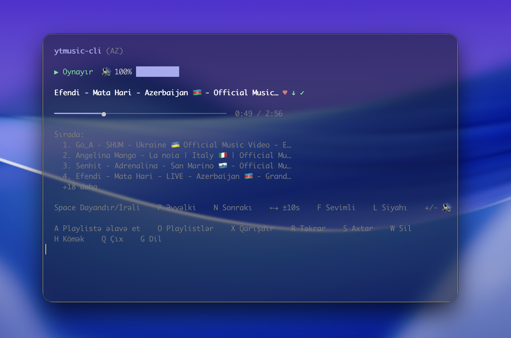
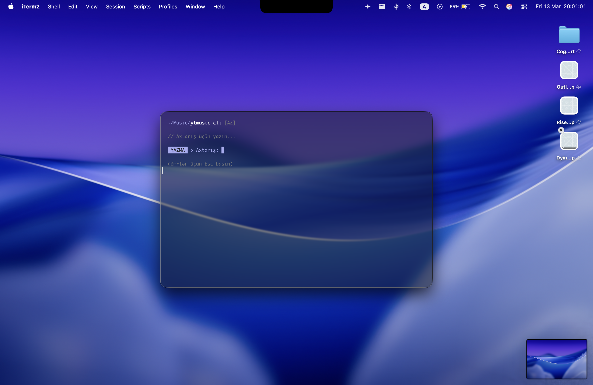

# ytmusic-player - YouTube Music Terminal Player

<div align="center">
  
</div>

`ytmusic-player` is a fast YouTube Music CLI, terminal music player, and command-line YouTube player for Windows, macOS, and Linux. Search YouTube Music, stream audio through `mpv`, download songs with `yt-dlp`, and control playback from a keyboard-driven TUI.

[](https://www.npmjs.com/package/ytmusic-player)
[](https://github.com/mammadovziya/ytmusic-player/actions/workflows/ci.yml)
[](#installation)
[](https://github.com/mammadovziya/ytmusic-player/releases)
[](https://bun.sh)
[](https://opensource.org/licenses/MIT)

## Project Links

- [Releases](https://github.com/mammadovziya/ytmusic-player/releases)
- [Tags](https://github.com/mammadovziya/ytmusic-player/tags)
- [Changelog](CHANGELOG.md)
- [Issues](https://github.com/mammadovziya/ytmusic-player/issues)
- [npm package](https://www.npmjs.com/package/ytmusic-player)

## Why Use It

- Fast terminal YouTube Music search and playback.
- Native audio playback through `mpv`.
- Offline downloads powered by `yt-dlp`.
- Local favorites, playlists, queue, shuffle, repeat, and volume controls.
- Cross-platform npm binaries for Windows x64, macOS Intel/Apple Silicon, and Linux x64/ARM64.

## Requirements

The player uses these command-line tools, which the npm installer sets up automatically:

- `mpv` - media playback backend.
- `yt-dlp` - YouTube metadata, stream, mix, and download helper.

During `npm install`, `ytmusic-player` checks for both tools and automatically installs missing dependencies when a supported package manager is available:

- Windows: `winget`
- macOS: `brew`
- Linux: `apt-get`, `dnf`, `yum`, `pacman`, `zypper`, or `apk`

If npm lifecycle scripts are disabled with `--ignore-scripts`, the same setup runs on first launch. Set `YTMUSIC_SKIP_AUTO_INSTALL=1` to disable both automatic attempts and show manual install hints instead.

## Platform Support

| Platform | Architecture | Install path |
| :--- | :--- | :--- |
| Windows | x64 | npm package `@mammadovziya/ytmusic-player-win32-x64` |
| macOS | Apple Silicon | npm package `@mammadovziya/ytmusic-player-darwin-arm64` |
| macOS | Intel | npm package `@mammadovziya/ytmusic-player-darwin-x64` |
| Linux | x64 | npm package `@mammadovziya/ytmusic-player-linux-x64` |
| Linux | ARM64 | npm package `@mammadovziya/ytmusic-player-linux-arm64` |

## Installation

### Windows

Install the CLI from npm. The installer also installs missing `mpv` and `yt-dlp` dependencies through winget:

```powershell
npm install -g ytmusic-player
ym
```

The npm package includes a native Windows x64 binary and uses a Windows named pipe for `mpv` IPC.

### macOS

Install the CLI from npm. The installer also installs missing `mpv` and `yt-dlp` dependencies through Homebrew:

```sh
npm install -g ytmusic-player
ym
```

Alternatively, install the player and runtime dependencies together with Homebrew:

```sh
brew tap mammadovziya/tap
brew install ytmusic-cli
ym
```

### Linux

Install the CLI. The installer also installs missing `mpv` and `yt-dlp` dependencies through the available system package manager:

```sh
npm install -g ytmusic-player
ym
```

### From Source

```sh
bun install
bun run src/index.ts
```

## Commands

After installation, these commands launch the same player:

```sh
ytmusic-player
ym
```

Search for a song and immediately play the best result:

```sh
ym -s alors on danse
ym play alors on danse
ym --search "Alors on danse"
```

If a player is already running, these commands control it through a private per-user socket. If no player is running, `play`, `-s`, and `--search` start one automatically.

### Remote Control Commands

Run these commands from another terminal while the player is open:

| Command | Alias | Action |
| :--- | :--- | :--- |
| `ym mute` | `ym m` | Toggle mute |
| `ym next` | `ym n` | Play the next queued song |
| `ym prev` | `ym p` | Play the previous song |
| `ym pause` | | Pause playback |
| `ym resume` | | Resume playback |
| `ym toggle` | `ym t` | Toggle pause/resume |
| `ym volume 50` | | Set volume |
| `ym volume +10` | | Raise volume relatively |
| `ym volume -10` | | Lower volume relatively |
| `ym seek +10` | | Seek forward in seconds |
| `ym seek -10` | | Seek backward in seconds |
| `ym now` | `ym i` | Show the current song |
| `ym status` | | Show playback, volume, modes, and queue size |
| `ym shuffle on` | `ym x` | Set shuffle; the alias toggles it |
| `ym repeat off` | | Disable repeat |
| `ym repeat one` | | Repeat one song |
| `ym repeat all` | | Repeat all |
| `ym favorite` | `ym f` | Toggle the current song as a favorite |
| `ym download` | `ym d` | Download the current song |
| `ym queue` | | List queued songs |
| `ym queue clear` | | Clear the queue |
| `ym stop` | | Stop playback but keep the player open |
| `ym quit` | `ym q` | Close the running player |
| `ym help` | `ym h` | Show command help |

Commands other than `play`, `-s`, and `--search` report an error when no player is running. Run `ym --help` to see the complete command-line reference.

## Controls

| Key | Action |
| :--- | :--- |
| `Space` | Pause or resume |
| `Left` / `Right` | Seek -10s / +10s |
| `N` / `P` | Next or previous track |
| `+` / `-` | Volume up or down |
| `F` | Toggle favorite |
| `X` | Toggle shuffle |
| `R` | Cycle repeat mode |
| `U` | View playback queue |
| `I` | Show track info and URL |
| `A` | Add current track to a playlist |
| `S` | Return to search |
| `Q` / `Ctrl+C` | Quit |

## Features

- Search and play music directly from YouTube.
- Auto-filled radio mix queue after selecting a track.
- Favorites and local playlist management.
- Offline downloads saved under your Music folder.
- English, Azerbaijani, Turkish, Spanish, German, French, and Russian UI language support.
- Cross-platform `mpv` IPC support for Unix sockets and Windows named pipes.

## Privacy

- No analytics, telemetry, accounts, or browser cookies.
- `yt-dlp` runs with config, filesystem cache, and cookie loading disabled.
- `mpv` runs with user config, disk cache, resume files, cookies, and watch history disabled.
- Set `YTMUSIC_PROXY` to route yt-dlp traffic through a proxy:

```sh
YTMUSIC_PROXY=socks5://127.0.0.1:9050 ym
```

Network anonymity still depends on your network, proxy, or VPN. The app avoids local tracking and cookies, but it cannot hide your IP address by itself.

## Screenshots

<div align="center">
  
  <p><i>Keyboard-first YouTube Music playback in the terminal.</i></p>
</div>

## Development

```sh
bun run src/index.ts
bun test
bun run build
```

`bun run build` compiles platform packages under `npm/` for macOS, Linux, and Windows.

## License

MIT. See `LICENSE` for details.
