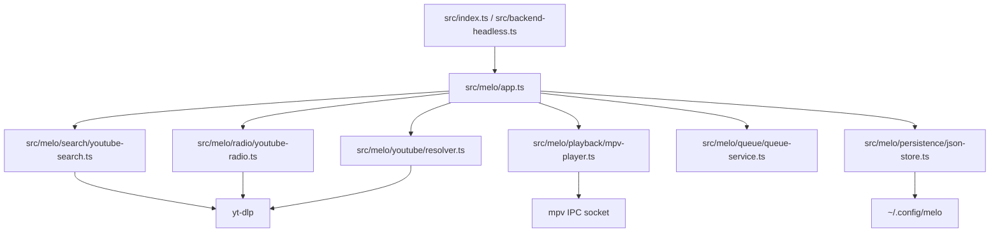

# Architecture

## Ust Seviye Bilesenler

## Modul Sorumluluklari

### `src/index.ts`

- TUI state machine ve klavye routing
- MELO backend'i (`MeloApp`) uzerinden oynatma
- Ayni NDJSON control socket protokolunu dinler

### `src/backend-headless.ts`

- Electron GUI icin TUI'siz backend
- `MeloApp` + control socket

### `src/melo/app.ts`

- Search, resolver, mpv, queue, radio, favorites/history orkestrasyonu
- Tek authoritative playback state ve event yayini

### `src/melo/playback/mpv-player.ts`

- Yerel `mpv` child process
- JSON IPC uzerinden play/pause/seek/volume/repeat

### `src/melo/search/youtube-search.ts` / `src/melo/radio/youtube-radio.ts`

- `yt-dlp` ile YouTube arama ve related/radio mix
- Metadata `Track` tipine normalize edilir

### `src/melo/persistence/json-store.ts`

- Favorites, history, playlists, downloads, settings JSON persistence
- Disk yolu `getConfigDir()` (`melo`); ilk acilista `ytmusic-cli` verisi kopyalanir, uzerine yazilmaz

### `src/ui.ts`

- Terminal render fonksiyonlari

### `src/types.ts`

- `Track` ve `Playlist` renderer/TUI kontratlari

## Mimari Karakteri

- YouTube kaynagi: `yt-dlp`
- Oynatma: yerel `mpv`
- GUI, preload/renderer IPC komut isimlerini degistirmeden NDJSON control socket kullanir
